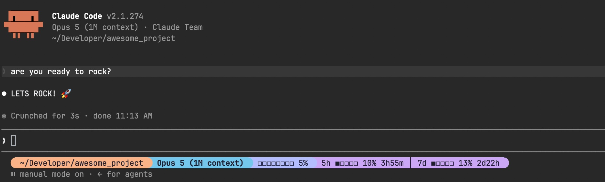

# statusline

A minimal powerline status line for Claude Code. It reads the statusline JSON
payload from stdin and prints one line: where you are, what git thinks, how much
you changed, which model you are on, and how much context and quota you have
left.



Any segment without data is skipped, and bad input renders an empty line instead
of failing, so the status line never breaks your session. Everything comes from
data Claude Code already pipes in (`rate_limits` needs Claude Code 2.1.80+) plus
one `git --no-optional-locks status` call, so there is no state, no API and no
lock file.

We wrote it because the status line we used before needed a wrapper script to
work around two bugs: a stray color reset that drew a black gap, and a `git
status` call that created `.git/index.lock` mid-session. Owning ~500 lines of
Rust turned out to be simpler than maintaining the workarounds.

## Install

```sh
brew tap saimaz/tap
brew install statusline
```

Then point Claude Code at it in `~/.claude/settings.json`:

```json
{
  "statusLine": {
    "type": "command",
    "command": "statusline"
  }
}
```

## Fonts

The rounded caps and the branch glyph are Nerd Font codepoints, so a terminal
without a patched font draws them as boxes. The status line picks a style on its
own: Ghostty, WezTerm and kitty get the glyphs, everything else falls back to a
plain style where the colored blocks do the separating. Nothing is lost, it just
looks squarer.

If the guess is wrong for your setup, say so:

```sh
export STATUSLINE_STYLE=nerd   # iTerm2 with a patched font, for example
export STATUSLINE_STYLE=plain  # or force the plain look anywhere
```

Our own font is JetBrainsMono Nerd Font.

## Hacking on it

```sh
git clone git@github.com:saimaz/statusline.git
cd statusline
cargo test
cargo build --release
```

To see it without Claude Code, feed it a payload:

```sh
printf '{"model":{"display_name":"Fable 5"},"workspace":{"current_dir":"'$PWD'"},"cost":{"total_lines_added":7,"total_lines_removed":2},"context_window":{"used_percentage":23},"rate_limits":{"five_hour":{"used_percentage":5,"resets_at":'$(($(date +%s)+17580))'}}}' | target/release/statusline
```

Point `statusLine.command` at the absolute path of `target/release/statusline`
while you work on it, and switch back to `statusline` when you are done. The
palette and the segment layout are constants in `src/render.rs` and
`src/segments.rs`, the terminal list lives in `Style::detect`.

## Releasing

Bump `version` in `Cargo.toml`, then tag and push:

```sh
git tag v0.2.0 && git push --tags
```

The release workflow builds the macOS binaries (arm64 and x86_64), attaches them
to a GitHub Release and bumps the formula in
[saimaz/homebrew-tap](https://github.com/saimaz/homebrew-tap), so everyone else
gets it with a plain `brew upgrade`.

## License

MIT, see [LICENSE](LICENSE).
